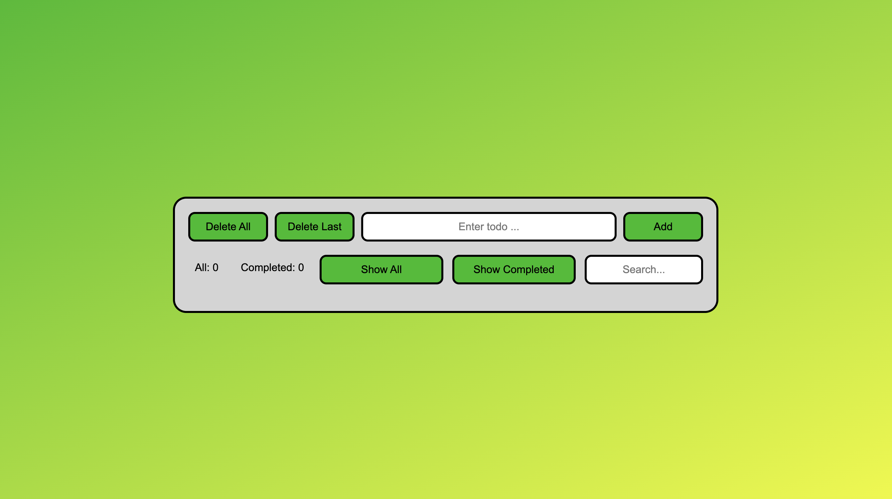

# Todo list
The studying project for practice JavaScript. A work with DOM with help of JavaScript and connect Web Storage API.

## Done
1. Created functions for generating DOM-elements with a help JavaScript;
2. Connected Web Storage API for saving tasks when page reload;
3. Used JavaScript modules.

[DEMO](https://stoyangalchev.github.io/To-Do-List/)

### Preview

